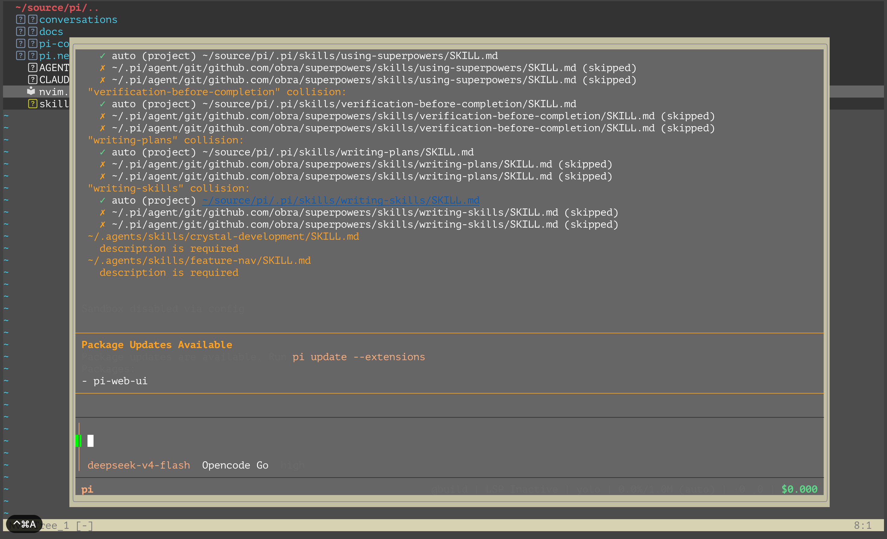

# pi.neovim

[](https://github.com/AgenticTimes/pi.neovim/actions/workflows/test.yml)

Neovim frontend for [Pi coding agent](https://pi.dev). Zero third-party runtime dependencies.

Runs the **native pi TUI** in a centered rounded float terminal — the same pattern as opencode
terminal integrations. Colors, spinners, `/` command menu, skill completion — all native pi.

<p align="center">
  
</p>

## Requirements

- Neovim ≥ 0.10 (zero third-party runtime deps)
- pi CLI ≥ 0.84 (`@earendil-works/pi-coding-agent`), in `PATH`

## Install (lazy.nvim)

```lua
{
  "AgenticTimes/pi.neovim",
  lazy = true,
  cmd = { "Pi", "PiToggle", "PiTermCopy" },
  config = function()
    require("pi").setup({})
  end,
}
```

## Usage

**Show / hide with the shortcut key:**

1. Press the toggle key (e.g. `,ai`, see mapping below) → the float opens with pi ready
2. Work inside the TUI as usual (type prompts, run `/` commands)
3. Hide it: press `,ai` again — or inside the float press `Ctrl-\ Ctrl-n` then `q`
4. Reopen any time with `,ai` — the pi process stays alive, so it's instant

> Closing the window does **not** kill the pi process; the session is preserved until you quit Neovim.

Recommended global keymap (Leader is `,`; avoid `,p` if you already map it to paste):

```lua
vim.keymap.set("n", "<Leader>ai", function() require("pi").toggle() end, { desc = "pi: toggle TUI float" })
```

Commands: `:Pi` / `:PiToggle` (toggle the float), `:PiTermCopy` (copy the terminal scrollback
to the clipboard — handy for grabbing transient TUI error/warning text before it clears).

## Options

```lua
require("pi").setup({
  executable = "pi",            -- pi CLI command name
  window = { width = 0.85, height = 0.85, border = "rounded" },
  warm_start = false,           -- preload pi in background for instant first open
  warm_start_delay = 2000,      -- warm-up delay (ms)
})
```

`warm_start = true` preloads pi a couple of seconds after Neovim starts, so the first
`<Leader>ai` opens instantly instead of waiting for pi's startup (which loads all your
extensions).

## Testing

```bash
nvim --headless -u NONE -i NONE -l tests/run.lua     # test suite
nvim --headless -u NONE -i NONE -l tests/smoke.lua   # smoke
```
